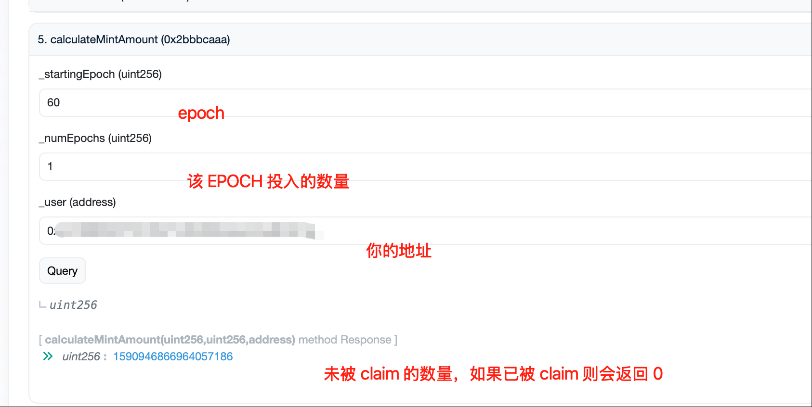

# WORM Miner 自动化脚本

这个项目包含两个自动化脚本，用于自动执行 WORM 挖矿的 burn 和 claim 操作。

## 📁 文件说明

- `autoburn.sh` - 自动 burn 脚本，持续不断地执行 burn 操作
- `autoclaim.sh` - 自动 claim 脚本，每小时检查并自动领取奖励
- `README.md` - 本说明文档

### 前置要求

1. 确保已安装 `worm-miner` 工具（参见下方安装步骤）
2. 准备好你的私钥
3. 准备好 RPC 节点地址（如 Alchemy API）

### 环境安装

#### 安装系统依赖

```bash
# 安装编译工具和依赖库
sudo apt install -y build-essential cmake libgmp-dev libsodium-dev nasm curl m4 git wget unzip nlohmann-json3-dev pkg-config libssl-dev libclang-dev

# 更新包管理器并安装额外依赖
sudo apt-get update
sudo apt-get install libssl-dev pkg-config
```

#### 安装 Rust

```bash
# 安装 Rust 工具链
curl --proto '=https' --tlsv1.2 -sSf https://sh.rustup.rs | sh

# 重新加载环境变量
source ~/.bashrc
```

#### 安装 worm-miner

```bash
# 克隆 worm-miner 仓库
git clone https://github.com/worm-privacy/miner && cd miner

# 下载必要参数文件
make download_params

# 编译并安装 worm-miner
cargo install --path .

# 返回主目录并重新加载环境变量
cd
source ~/.bashrc
```

#### 验证安装

```bash
# 检查 worm-miner 是否正确安装
worm-miner --help
```

如果看到帮助信息，说明安装成功！

### 获取自动化脚本

```bash
# 克隆本仓库并设置脚本权限
git clone https://github.com/AlphaAILabs/alpha-worm-eip-7503.git && cd alpha-worm-eip-7503 && chmod +x autoburn.sh autoclaim.sh
```

## 🔧 基础命令

### 查看账户信息

```bash
# 查看账户的基础信息
worm-miner info --network sepolia --private-key 私钥 --custom-rpc https://eth-sepolia.g.alchemy.com/v2/api_key
```

### 参与 WORM(\$bETH -> $WORM)

> [!IMPORTANT]
> **🚨 重要提示 🚨**
> **参与挖矿需要先质押 $bETH 代币才能获得 $WORM 奖励！这里是手动的！！！**

```bash
# 参与挖矿（手动）
worm-miner participate \
--amount-per-epoch 15 \
--num-epochs 1 \
--private-key 私钥 \
--network sepolia \
--custom-rpc https://eth-sepolia.g.alchemy.com/v2/api_key

# amount-per-epoch 代表的是每个 epoch 投入多少个 bETH
# num-epochs 代表的是参与多少个 epoch
```

## 📖 使用指南

### 基本使用

#### 1. 安装 tmux（推荐）

```bash
# Ubuntu/Debian (默认 Ubuntu 自带 tmux)
sudo apt install tmux

# CentOS/RHEL
sudo yum install tmux
```

#### 2. 使用 tmux 后台运行（推荐方式）

```bash
# 创建 autoburn 会话
tmux new -s auto_burn

# 在会话中运行脚本
./autoburn.sh --private-key "0x你的私钥" --custom-rpc "https://eth-sepolia.g.alchemy.com/v2/你的API密钥"

# 按 Ctrl+B，然后按 D 分离会话（脚本继续运行）

# 创建 autoclaim 会话
tmux new -s auto_claim

# 在会话中运行脚本
./autoclaim.sh --private-key "0x你的私钥" --custom-rpc "https://eth-sepolia.g.alchemy.com/v2/你的API密钥"

# 按 Ctrl+B，然后按 D 分离会话（脚本继续运行）
```

#### 3. 直接运行（前台运行）

```bash
# 使用命令行参数运行 autoburn
./autoburn.sh --private-key "0x你的私钥" --custom-rpc "https://eth-sepolia.g.alchemy.com/v2/你的API密钥"

# 使用命令行参数运行 autoclaim
./autoclaim.sh --private-key "0x你的私钥" --custom-rpc "https://eth-sepolia.g.alchemy.com/v2/你的API密钥"

# 或者设置环境变量
export PRIVATE_KEY="0x你的私钥"
export CUSTOM_RPC="https://eth-sepolia.g.alchemy.com/v2/你的API密钥"
./autoburn.sh
./autoclaim.sh
```

## ⚙️ 配置选项

### autoburn.sh 参数

| 参数 | 说明 | 默认值 |
|------|------|--------|
| `--private-key` | 钱包私钥 | `0x65` |
| `--custom-rpc` | RPC 节点地址 | `https://1rpc.io/sepolia` |

### autoclaim.sh 参数

| 参数 | 说明 | 默认值 |
|------|------|--------|
| `--private-key` | 钱包私钥 | `0x65` |
| `--custom-rpc` | RPC 节点地址 | `https://1rpc.io/sepolia` |
| `--network` | 网络名称 | `sepolia` |
| `--num-epochs` | 每次 claim 的 epoch 数量 | `1` |

## 🔄 工作原理

### autoburn.sh

1. 持续不断地执行 `worm-miner burn` 命令（无延迟）
2. 使用固定参数：
   - `--amount 1`
   - `--spend 0.999`
   - `--fee 0.001`
3. 显示执行结果和状态

### autoclaim.sh

1. 每10分钟检查一次是否有可领取奖励（因为合约按epoch进行claim）
2. 调用 `worm-miner info` 获取当前状态
3. 解析输出，检查 `Claimable WORM (10 last epochs)` 是否大于 0
4. 如果有可领取奖励，从 `Current epoch - 1` 开始 claim
5. 执行 `worm-miner claim` 命令领取奖励
6. 每个epoch都需要发送claim交易来领取奖励

## 📊 示例输出

### worm-miner info 输出示例

```
Current epoch: 48
BETH balance: 0.000000000000000000
WORM balance: 94.206584437991506052
Claimable WORM (10 last epochs): 0.000000000000000000
Epoch #48 => 0.000000000000000000 / 227.642900000000000000 (Expecting 0.000000000000000000 WORM)
Epoch #49 => 0.000000000000000000 / 174.602600000000000000 (Expecting 0.000000000000000000 WORM)
...
```

### 脚本运行示例

```bash
# autoburn.sh 输出
🔥 2024-01-15 10:30:00: Starting burn attempt...
✅ Burn successful!
🔥 2024-01-15 10:30:01: Starting burn attempt...
✅ Burn successful!
🔥 2024-01-15 10:30:02: Starting burn attempt...

# autoclaim.sh 输出
🕐 2024-01-15 10:00:00: Starting claim check...
Getting miner info...
Current epoch: 48
Claimable WORM: 0.000000000000000000
❌ No claimable rewards found
💤 No claimable rewards at this time, skipping claim...
⏰ Next check in 10 minutes...
```

## ⚠️ 实际使用注意事项

### RPC 连接问题

在实际测试过程中发现，由于RPC的问题，脚本可能会偶尔卡住。解决方法：

```bash
# 进入 autoburn 会话
tmux a -t auto_burn

# 如果发现脚本卡住，按 Ctrl+C 停止
# 然后重新执行脚本
./autoburn.sh --private-key "你的私钥" --custom-rpc "你的RPC地址"
```

### Claim 频率说明

- autoclaim 脚本目前每隔10分钟检测一次
- 合约是按照 epoch 进行 claim 的
- 每个 epoch 都需要发送 claim 交易来领取奖励
- 建议及时 claim，避免错过奖励

### 手动检查未领取奖励

如果想查看自己哪个 epoch 有奖励没申领：

1. 访问合约地址：https://sepolia.etherscan.io/address/0x78efe1d19d5f5e9aed2c1219401b00f74166a1d9#readContract

2. 找到 `calculateMintAmount` 方法进行检查

3. 输入参数：
   - `user`: 你的钱包地址
   - `epoch`: 要查询的 epoch 编号

4. 如果返回值大于 0，说明该 epoch 有未领取的奖励



5. 如果发现有未被 claim 的奖励，应该尽早进行 claim


## 🛡️ 安全注意事项

1. **私钥安全**：
   - 不要在脚本中硬编码私钥
   - 使用环境变量或命令行参数传递私钥
   - 确保私钥文件权限设置正确

2. **网络安全**：
   - 使用可信的 RPC 节点
   - 建议使用 HTTPS 连接

3. **资金安全**：
   - 在主网使用前，先在测试网测试
   - 监控脚本运行状态，避免异常消耗

## 🔧 故障排除

### 常见问题

1. **权限错误**
   ```bash
   chmod +x autoburn.sh autoclaim.sh
   ```

2. **worm-miner 命令未找到**
   - 确保 worm-miner 已正确安装并在 PATH 中

3. **RPC 连接失败**
   - 检查网络连接
   - 验证 RPC URL 和 API 密钥

4. **私钥格式错误**
   - 确保私钥以 `0x` 开头
   - 检查私钥长度和格式

### 停止脚本

使用 `Ctrl+C` 停止正在运行的脚本。

## 🎛️ tmux 会话管理

### 常用 tmux 命令

```bash
# 查看所有会话
tmux list-sessions
tmux ls

# 连接到指定会话
tmux attach-session -t auto_burn
tmux a -t auto_burn  # 简写
tmux a -t auto_claim

# 杀死指定会话
tmux kill-session -t auto_burn
tmux kill-session -t auto_claim

# 杀死所有会话
tmux kill-server

# 在会话内的快捷键
# Ctrl+B, D  - 分离会话（脚本继续运行）
# Ctrl+C     - 停止当前脚本
# exit       - 退出会话
```


## 📝 日志和监控

### 在 tmux 中查看日志

脚本在 tmux 会话中运行时，所有输出都会显示在会话中：
- 时间戳
- 操作状态（成功/失败）
- 错误信息
- 执行结果

### 保存日志到文件（可选）

如果需要保存日志到文件：

```bash
# 创建带日志记录的会话
tmux new-session -d -s auto_burn 'bash -c "./autoburn.sh --private-key \"...\" --custom-rpc \"...\" | tee autoburn.log"'
tmux new-session -d -s auto_claim 'bash -c "./autoclaim.sh --private-key \"...\" --custom-rpc \"...\" | tee autoclaim.log"'
```

## 🤝 贡献

欢迎提交 Issue 和 Pull Request 来改进这些脚本。

## ⚠️ 免责声明

使用这些脚本需要自担风险。请在使用前充分测试，并确保理解相关的风险和成本。
